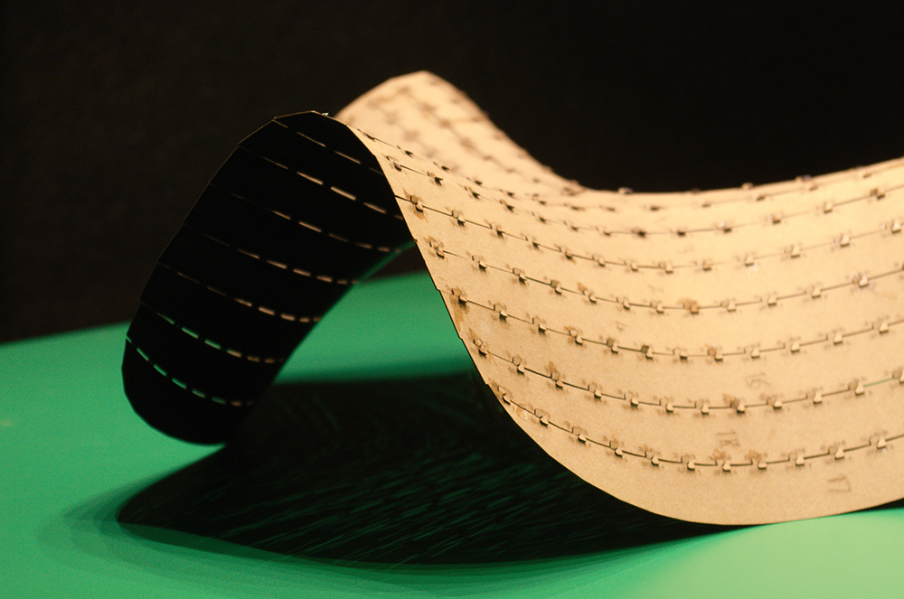
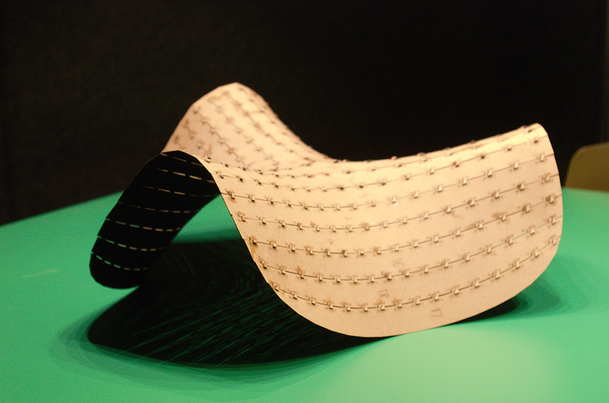
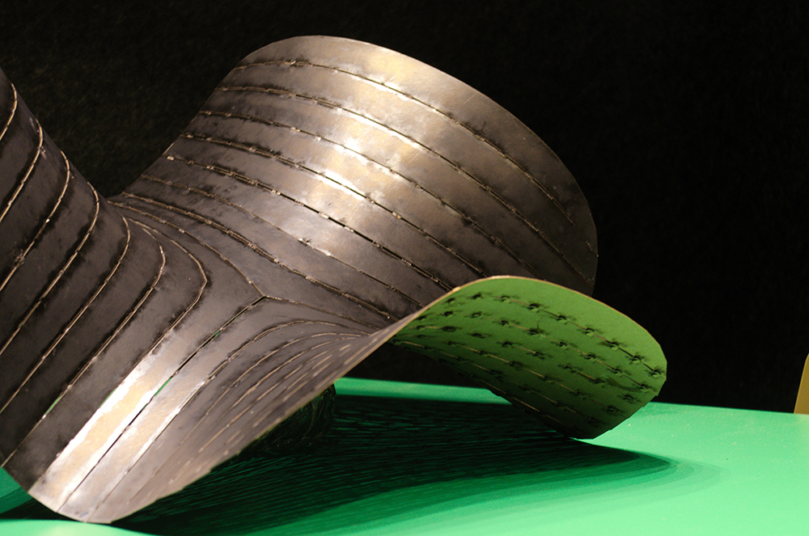
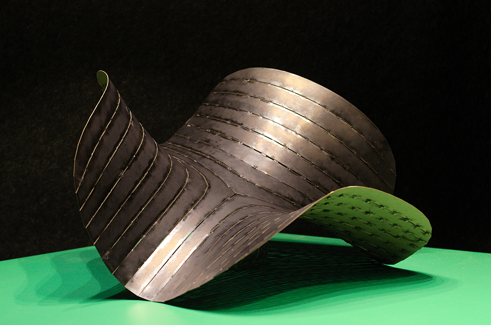
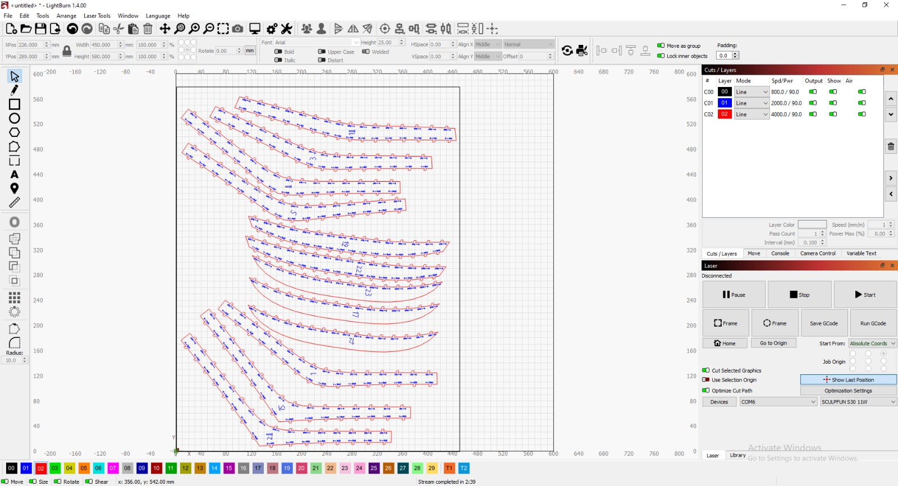
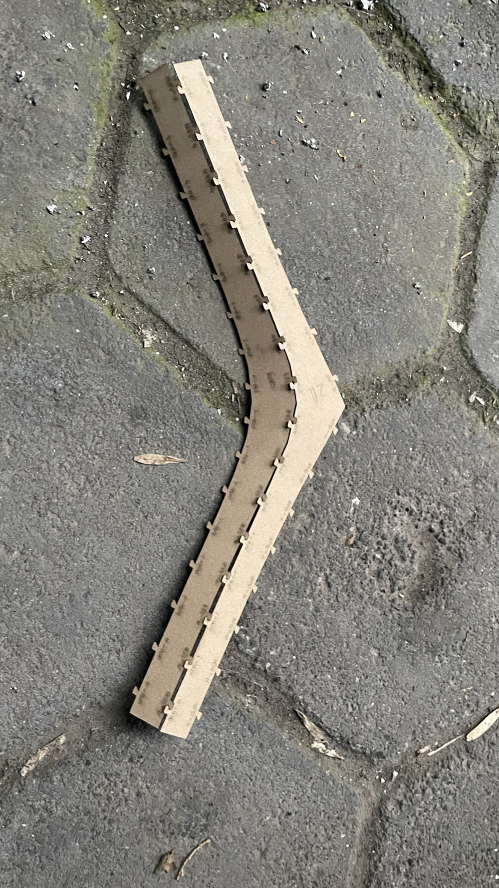
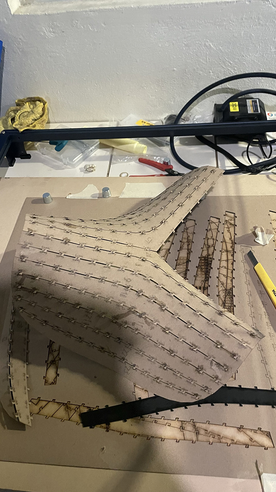
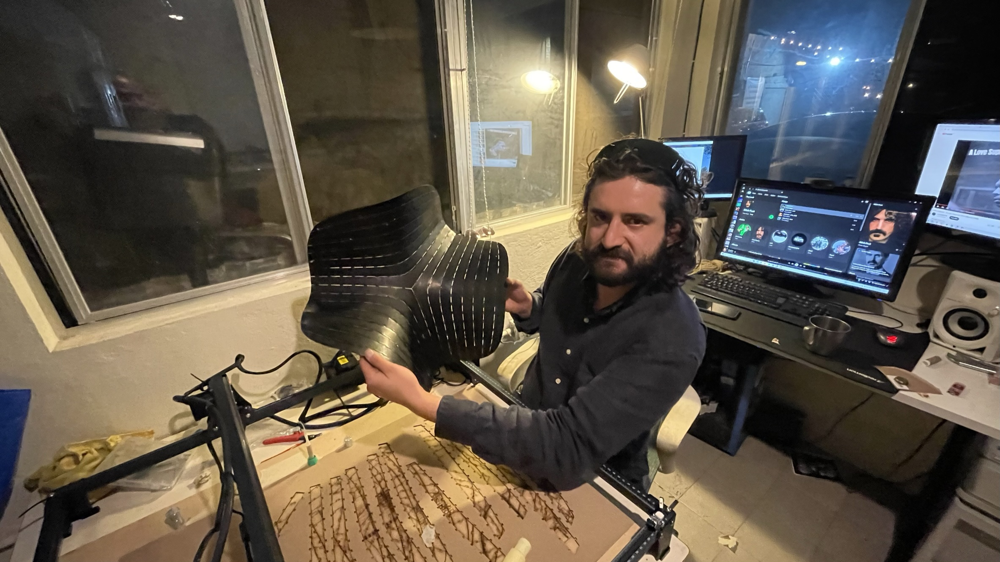
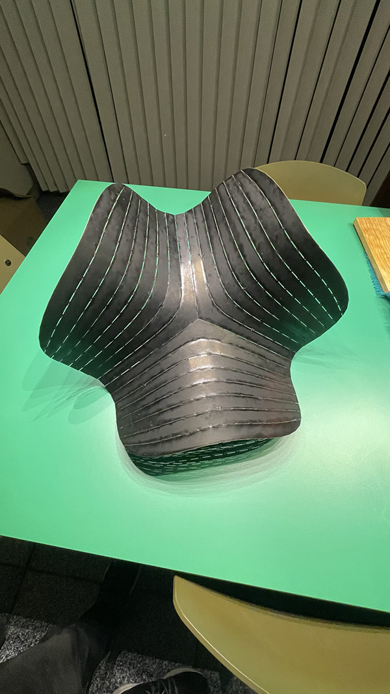

# Proceso de Fabricación Digital

Una vez que se ha producido una malla con la técnica elegida, se ha segmentado y producido los datos de fabricación, se puede hacer la maqueta con algo de facilidad. 

<video width="640" height="480" controls>
  <source src="../img/f2.MP4" type="video/mp4">
 Your browser does not support the video tag.
</video>

